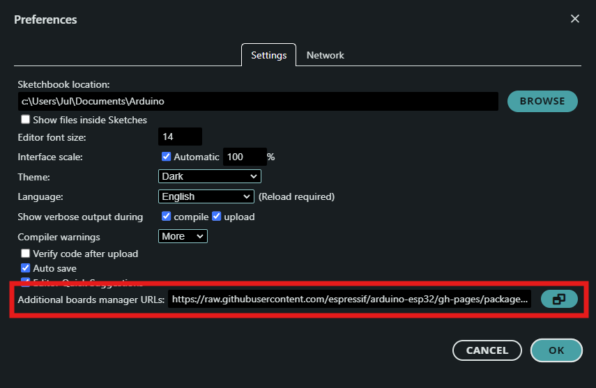

## How to compile with Arduino IDE

1. Open sketch file `slider.ino`
1. Open Preferences menu (`File->Preferences`)
1. In *Additional boards manager URLs*, paste this: 
   ```
   https://raw.githubusercontent.com/espressif/arduino-esp32/gh-pages/package_esp32_index.json
   https://raw.githubusercontent.com/ricardoquesada/esp32-arduino-lib-builder/master/bluepad32_files/package_esp32_bluepad32_index.json
   ```
   
1. In `Tools->Board` choose `esp32_bluepad32->ESP32-WROOM-DA Module`
1. Compile with `Sketch->Verify/Compile`